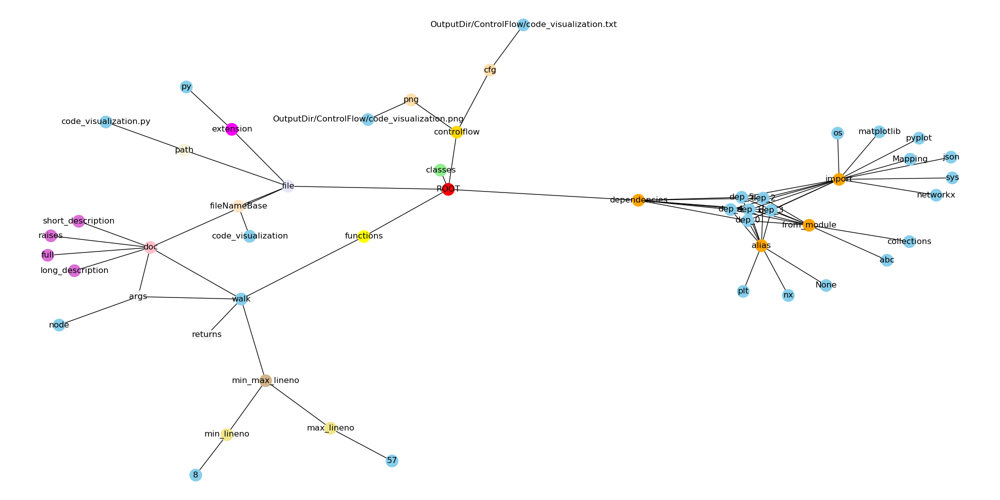
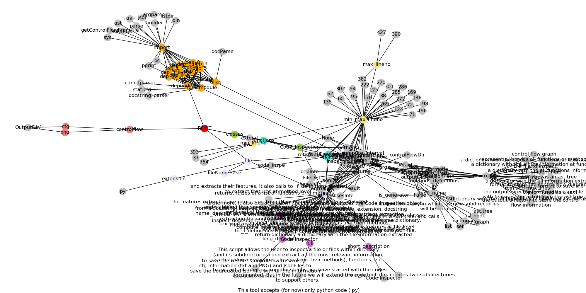

# code_inspector

The code_inspector allows the user to inspect a file or files within directory 
(and its subdirectories) and extract all the most relevant information, 
such as documentations, classes (and their methods), functions, etc.

It uses [AST](https://en.wikipedia.org/wiki/Abstract_syntax_tree), more specifically
the [ast](https://docs.python.org/3/library/ast.html) module in Python, generating
a tree of objects (per file) whose classes all inherit from [ast.AST](https://docs.python.org/3/library/ast.html#ast.AST).

code_inspector parsers each of the input file(s) as an ast tree, and walks across them, extracting
the relevant information, storing it as a JSON file.  Furthermore, it also captures the control
flow of each input file(s), by using another two libraries:

-[cdmcfparser](https://pypi.org/project/cdmcfparser/): The module provided functions can takes a file with a python code or a character buffer, parse it and provide back a hierarchical representation of the code in terms of fragments. Each fragment describes a portion of the input: a start point (line, column and absolute position) plus an end point (line, column and absolute position).

-[staticfg](./staticfg): StatiCFG is a package that can be used to produce control flow graphs (CFGs) for Python 3 programs. The CFGs it generates can be easily visualised with graphviz and used for static analysis. We have a flag in the code (FLAG_PNG) to indicate if we want to generate this type of control flow graphs or not. **Note**: The original code of this package can be found [here](https://github.com/coetaur0/staticfg), but given a bug in the package's source code, we forked it, and fixed it in our [repository](./staticfg)  

For parsing the docstrings, we use [docstring_parser](https://pypi.org/project/docstring-parser/), which has support for  ReST, Google, and Numpydoc-style docstrings. Some (basic) tests done using this library can be found at [here](./test_docstring_parser/).
 

## Ideas for tool's name:
 - kodeXplain
 - sofexplain
 - kode_inspector

## Requirements

Prepare a virtual Python3 enviroment and install the required packages.

`pip install -r requirements.txt`

- Dependencies: 
  - cdmcfparser
  - docstring_parser

## Execution

The tool can be executed to inspect a file, or all the files of a given directory (and its subdirectories).
For example, it can be used to inspect all the python files of a given GitHub repository (that has been previously cloned locally).

`python code_inspector.py <FILE.py | DIRECTORY>`

## Outputs

* Results are stored inside the **OutputDir** directory, which is created automatically, if it is does not exits.

* If the input is a **file**, the tool will create automatically two subdirectories inside **OuptuDir**:
	- **JsonFiles** directory: with a json file (with the name of the file + ".json") of the information extracted
	- **ControlFlow** directory: with one or two (depending on the FLAG_PNG) Control Flow files will be created

* If the input is a **directory**, the tool will create the previous directories (**JsonFiles** and **ControlFlow**) but per **directory** and its **subdirectories** instead, under **OutputDir**, storing all the information extracted per file found in each directory and/or subdirectory. The **OutputDir** directory will have the same subdirectory structure as the input directory given by the user. Furthermore, in order to facilitate the inspection of all the features extracted for a given directory (and its subdirectories), we have aggreagated all the previous json information in a **single json file** stored at **OutputDir/DirectoryInfo.json**.In other words, **OutputDir/DirectoryInfo.json**, represents all the features extracted of all files found in a given directory (and its subdirectories). 

## JSON FILE

* File features:
```
- file: 
	- path: <file_name>.py
        - fileNameBase: <file_name>
        - extension: py
        - doc:
               - long_description
               - short_description
               - full

```
* Dependencies features: 
```
- dependencies: (list of dependencies)
	-dep_<0>:
		- from_module
		        - 0: 
                        - ..: 
		- import 
			- 0:
			- ..:
		- alias
	-dep_<1>:
               	- ...
```
* Classes features:
```
- classes: (list of classes)
	-<class_name>:
		- doc:
			- long_description
			- short_description
			- full
                - extend
		- min_max_lineno:
			- min_lineno:
			- max_lineno:
		- methods (list of methods found within the class):
			-<method_name>:
				- doc:
					- long_description
					- short_description
					- args (list of arguments per method **documented**):
						- <name_arg>:
							- description
							- type_name
                                                        - is_optional
                                                        - default
						- <name_arg>:
							-  ...
					- returns: (information about the return *documented*)
						- description
						- type_name
                                		- is_generator
						- return_name
					- raises: (list of raises per method **documented**)
						- 0:
							- description
							- type_name
						- ...
				- args (list of arguments per method)
					- 0:
					- ..:
				- returns (list of returns found within the method)
					- 0:
					- ..:
				- min_max_lineno:
					- min_lineno:
					- max_lineno:
			-<method_name>:
				- ...
	-<class_name>:
		- ...				
```
   

* Function features:

```
- functions: (list of functions found within the class):
 	-<function_name>:
        	- doc:
                	- long_description
                        - short_description
                        - args (list of arguments per function **documented**):
                        	- <name_arg>:
                                	- description
                                        - type_name
                                        - is_optional
                                        - default
                                - <name_arg>:
                                        - ....
			- returns:
				- description
				- type_name
                                - is_generator
				- return_name
			- raises:(list of raises per function *documented**)
				- 0:
					- description
					- type_name
				- ...
                - args (list of arguments per function)
                	- 0:
                        - ..:
		- returns (list of returns found within the function)
			- 0:
			- ..:
                - min_max_lineno:
                	- min_lineno:
                        - max_lineno:
	-<function_name>:
                - ...
```
* ControlFlow features:
```
- controlflow:
	- cfg: Path of the cfg as a txt
	- png: Path of the cfg as a PNG

```
## Test

  We have executed our tool with itself.

  `python code_inspector.py code_inspector.py`


  Results of this test are available here:

* [Json File](./OutputDir/JsonFiles) 
* [Control Flow](./OutputDir/ControlFlow)

Notice how our tool, has automatically created two subdirectories inside **OuptuDir**, JsonFiles and ControlFlow.
Futhermore, out tool has saved the extracted information in a json file with the same NameBase as the file to inspect
(in this case **code_inspector.py**). And it also has saved the control flow (as a text and as a figure) in a similar maner, 
inside the ControlFlow directory (using also the same NameBase as the file to inspect). 

See bellow for more clarity:

```
  > ls OuptuDir
   JsonFiles	ControlFlow
  > cd OutputDir
  > ls JsonFiles/
   code_inspector.json
  > ls ControlFlow/
    code_inspector.png	code_inspector.txt
```

## Visualizing results

```
python code_visualization.py OutputDir/JsonFiles/<FILE>.json 
```

#### Example 1: visualizing the code_visualization.py



#### Example 2: visualizing the code_inspector.py



