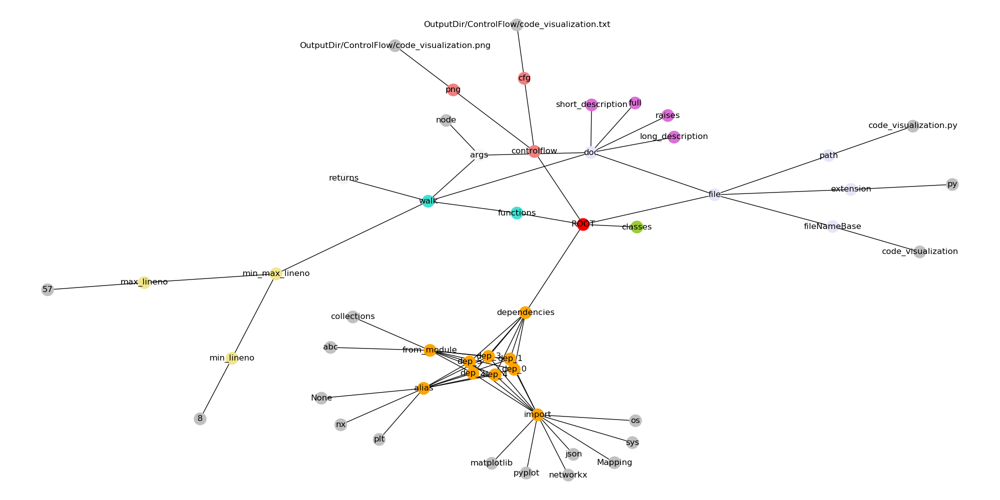

`inspect4py` results are stored by default inside an `OutputDir` directory, which is created automatically if it is does not exits. Users have also the possibility to indicate their own directory name. 

If the input is a **file**, the tool will automatically create two subdirectories inside `OuptuDir`:

- **JsonFiles** directory: with a JSON file (with the name of the file + ".json") of the information extracted
- **ControlFlow** directory: containing one or two control flow files depending on the execution options.

If the input is a **directory**, inspect4py will create the **JsonFiles** and **ControlFlow** directories for each **directory** in the original repository, under `OutputDir`. These folders store all the information extracted per file. The `OutputDir` directory will have the same subdirectory structure as the input directory given by the user. In order to ease the inspection of all the features extracted for a given directory (and its subdirectories) we have aggregated all generated json information in a **single JSON file** stored at `OutputDir/DirectoryInfo.json`.In other words, `OutputDir/DirectoryInfo.json`, represents all the features extracted of all files found in a given directory (and its subdirectories). 

## JSON file format

### File features:
```
- file: 
	- path: <file_name>.py
        - fileNameBase: <file_name>
        - extension: py
        - doc:
               - long_description
               - short_description
               - full

```
### Dependency features: 
```
- dependencies: (list of dependencies)
	-dep_<0>:
		- from_module
		        - 0: 
                        - ..: 
		- import 
			- 0:
			- ..:
		- alias
	-dep_<1>:
               	- ...
```
### Class features:
```
- classes: (list of classes)
	-<class_name>:
		- doc:
			- long_description
			- short_description
			- full
                - extend
		- min_max_lineno:
			- min_lineno:
			- max_lineno:
		- methods (list of methods found within the class):
			-<method_name>:
				- doc:
					- long_description
					- short_description
					- args (list of arguments per method **documented**):
						- <name_arg>:
							- description
							- type_name
                                                        - is_optional
                                                        - default
						- <name_arg>:
							-  ...
					- returns: (information about the return *documented*)
						- description
						- type_name
                                		- is_generator
						- return_name
					- raises: (list of raises per method **documented**)
						- 0:
							- description
							- type_name
						- ...
				- args (list of arguments per method)
					- 0:
					- ..:
				- returns (list of returns found within the method)
					- 0:
					- ..:
				- min_max_lineno:
					- min_lineno:
					- max_lineno:
			-<method_name>:
				- ...
	-<class_name>:
		- ...				
```
   
### Function features:

```
- functions: (list of functions found within the class):
 	-<function_name>:
        	- doc:
                	- long_description
                        - short_description
                        - args (list of arguments per function **documented**):
                        	- <name_arg>:
                                	- description
                                        - type_name
                                        - is_optional
                                        - default
                                - <name_arg>:
                                        - ....
			- returns:
				- description
				- type_name
                                - is_generator
				- return_name
			- raises:(list of raises per function *documented**)
				- 0:
					- description
					- type_name
				- ...
                - args (list of arguments per function)
                	- 0:
                        - ..:
		- returns (list of returns found within the function)
			- 0:
			- ..:
                - min_max_lineno:
                	- min_lineno:
                        - max_lineno:
	-<function_name>:
                - ...
```
### ControlFlow features:
```
- controlflow:
	- cfg: Path of the cfg as a txt
	- png: Path of the cfg as a PNG
```
### Test information:
```
"tests": [
    {
      "type": "test",
      "run": "python path_to_test/test.py",
      "has_structure": "main", # (if the test has a main function)
      "mentioned_in_readme": false # (if the test is not mentioned 
	  								the main README file)
    },
    
  ],
```
### Software invocation:
```
"software_invocation": [
    {
      "run": [
        "somef"
      ],
      "type": "package", # Types include package, library, service,	
	  					   and script
      "installation": "pip install somef",
      "ranking": 1 # Relevance sorted in ascending order
    },
    {
      "type": "script",
      "run": "python path_to_script/script.py",
      "has_structure": "main",
      "mentioned_in_readme": false,
      "ranking": 2
    },
  ],
```
### Software type:
```
"software_type": "package"
```
## Example

The easiest example is to run `inspect4py` against itself:

  `inspect4py -i path_to_github_repo/inspect4py -f`


Results of this run include a JSON file and a control flow file

If no output directory is specified, `inspect4py` will place the documentation in **OuptuDir**, including a JSON File and a control flow file for each code file found in the analyzed directory.

<!--
## Visualizing results

We include visualization tools to explore the results in an easy manner. Below we show some visualizations of the results for `code_inspector` code:

```
python code_visualization.py OutputDir/JsonFiles/<FILE>.json 
```
 

### Example 1: visualizing code_visualization.py



### Example 2: visualizing code_inspector.py


-->